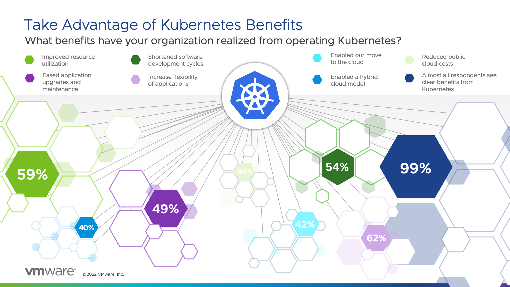
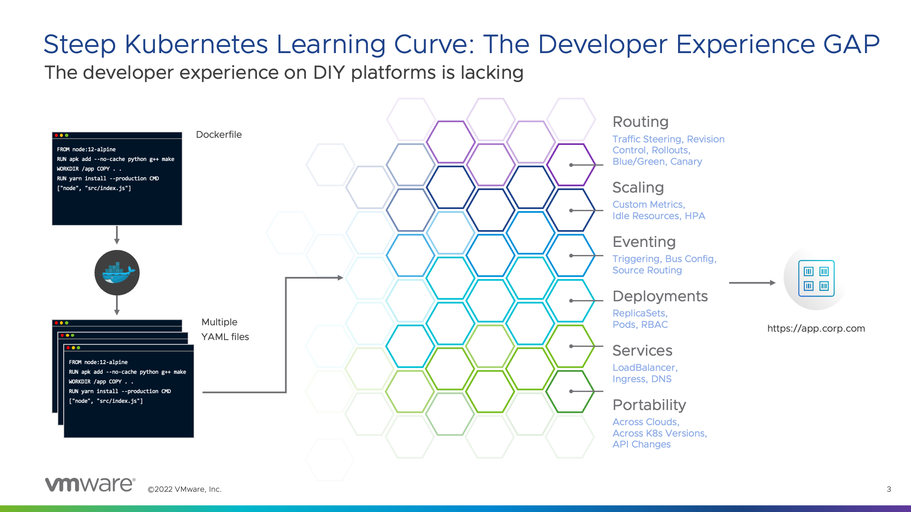
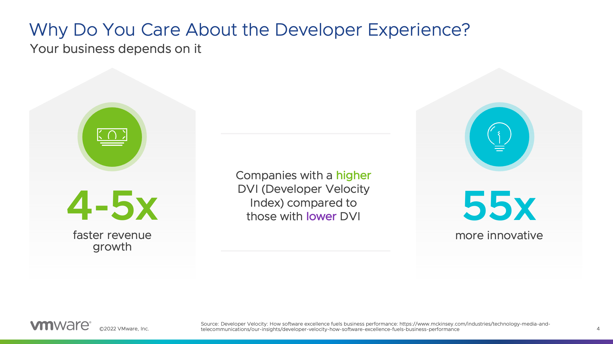
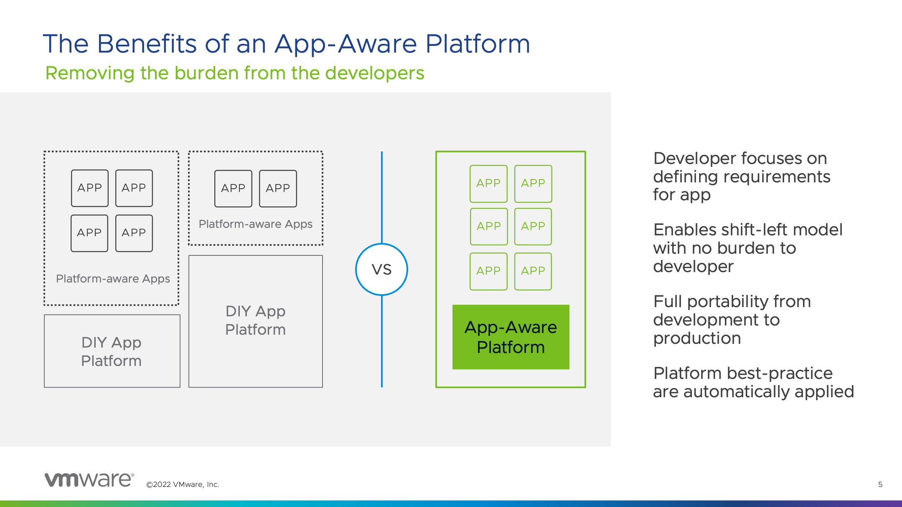
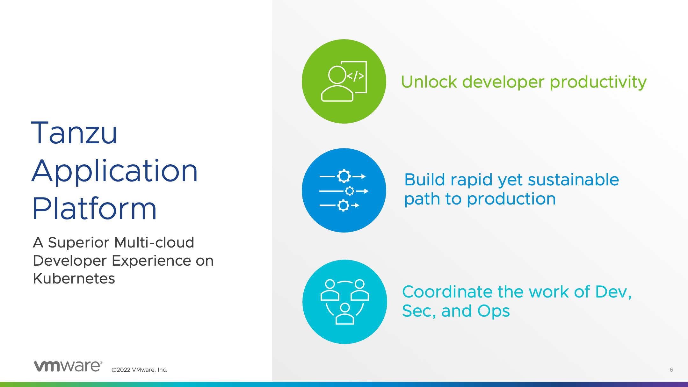
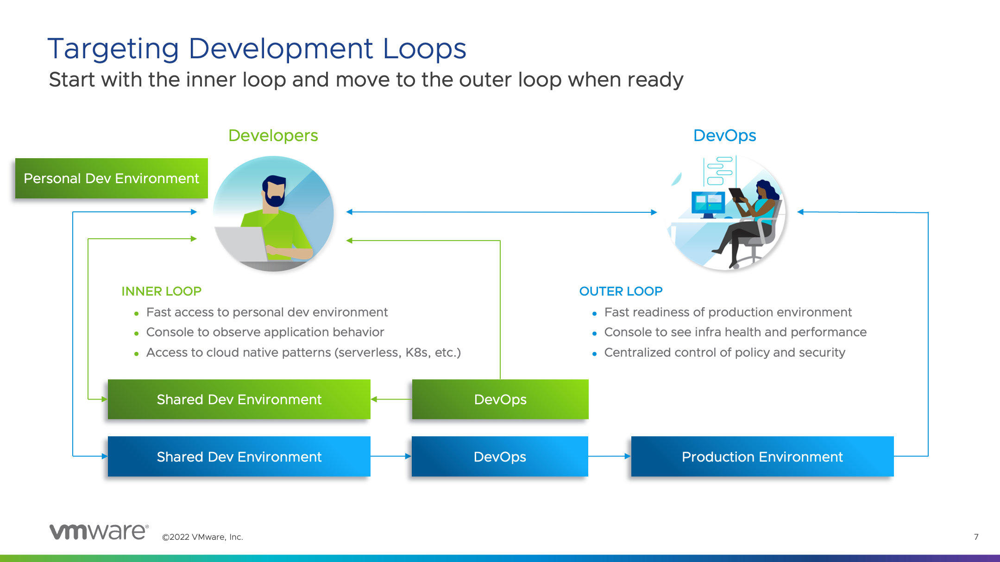
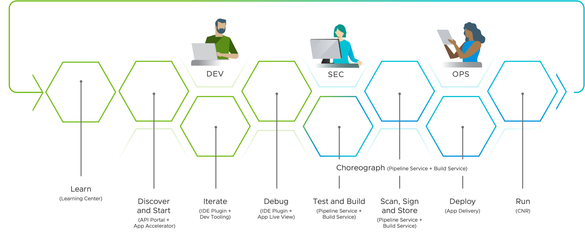

You already may have heard that **Kubernetes is the new infrastructure abstraction standard**.
It's already commodity in the public cloud and the same will happen on-premises.

More than 65% of organizations are already using Kubernetes in production and others will start their infrastructure modernization journey soon to get **benefits** like:
- Improved resource utilization
- Shortened software development cycles
- and Kubernetes also enables a hybrid cloud model

However, due to the complexity of Kubernetes and its ecosystem the **move to Kubernetes is challenging** for operators and developers. 
The most common challenges are the **lack of internal experience and expertise** and **to meet the security and compliance requirements**.

To **maximize the value of a platform** with minimal delivery time and risk we should treat our platforms as a product with a **user-centric approach**.

The **users of the platform are the developers**.

Due to the **lack of user focus** lots of DIY platforms at our customers have a **big developer experience GAP**.

That's not only because building of Kubernetes platform is complex, also deploying applications on Kubernetes requires expertise in many Container and Kubernetes concepts. 
And once developers learned them, they still must spend a lot of time maintaining containers, writing YAML templates, and orchestrating many moving Kubernetes parts.

Organizations with a **higher developer velocity index grow faster and are more innovative** than those with lower developer velocity index.
This is why we should you care about the Developer Experience! 

Like in the days when the Waterfall model was the standard for software development, **developers today shouldn’t have to care where and how their applications are running** and focus on adding business value by implementing new features.

The idea of an **application-aware platform** is to **abstract away all those platform and infrastructure specifics** and give the developers an interface where they only have to define the requirements of the applications they want to deploy on the platform. 

The **VMware Tanzu Application Platform** (TAP) is a modular, **application-aware platform** that runs on any compliant public cloud or on-premises Kubernetes cluster. It delivers a superior **developer experience** with a prepaved path to production, including all the needed components preconfigured for developer teams to build and deploy software quickly and securely. 

The VMware Tanzu Application Platform provides capabilities and **tools to optimize the path to production** – the so-called **”outer loop”**.
In addition, it also provides capabilities and **tools for the “inner loop”** to help development teams working in a shared environment to build applications. 

Here is an overview of some of the capabilities of the VMware Tanzu Application Platform that provide a streamlined and secure end-to-end DevSecOps experience on any Kubernetes.

